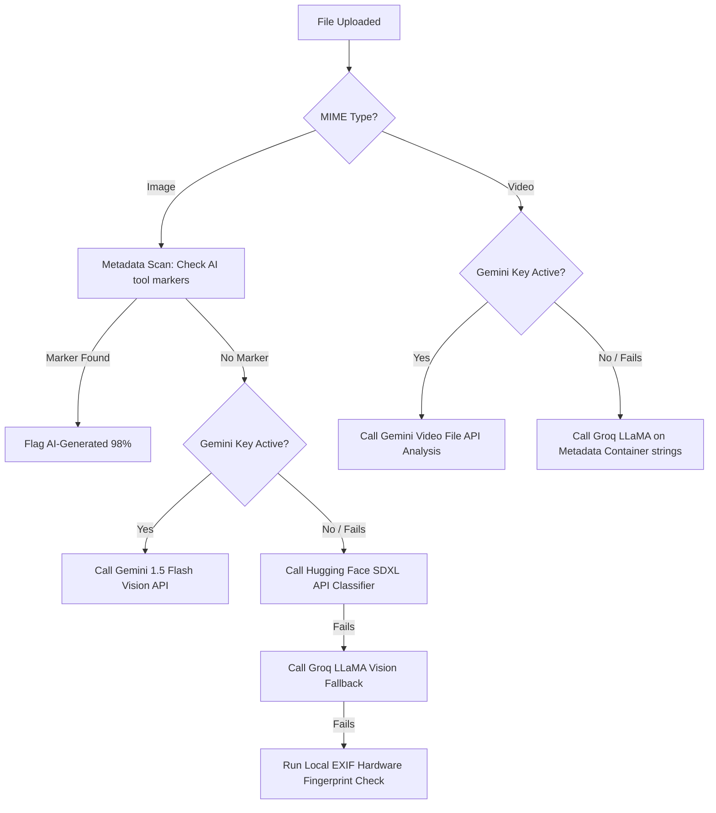

# 🛡️ CyberShield AI

> Next-generation, AI-driven cybersecurity platform for real-time threat intelligence, malware heuristics, deepfake forensic analysis, and automated security operations.

CyberShield AI is built for the modern digital battlefield, combining advanced local static heuristics with cutting-edge AI orchestration (Google Gemini, Groq LLaMA, Hugging Face SDXL models) and active security integrations (VirusTotal API, NIST NVD, live IMAP Gmail Spam Shield).

---

## 🚀 Key Features & Modules

### 1. 🦠 Malware Heuristics & Scan Engine
- **Dual-Layer Analysis**: Scans uploaded files using the **VirusTotal API** while executing real-time **local static heuristics**.
- **Shannon Entropy Calculation**: Computes byte-level entropy (0.0 to 8.0) to flag packing, obfuscation, or encryption common in malware.
- **Forensic Mismatch Scan**: Identifies extension masquerading (e.g., an executable masquerading as a `.png` or `.pdf` structure).
- **PDF Exploit Scanner**: Checks for active exploits like `/JavaScript`, `/OpenAction`, `/Launch`, or `/EmbeddedFiles`.
- **Malware Explanation**: Summarizes findings automatically using `llama-3.3-70b` on Groq, formatting reports in a monospace retro cyber terminal style.

### 2. 🎭 Phishing & Deepfake Interceptor
- **Image Analysis**: Inspects images for deepfake/AI footprints using a multi-tiered analysis chain:
  1. **Local Metadata Forensics**: Flags known generative AI tool metadata (Midjourney, DALL-E, Stable Diffusion) or verifies hardware EXIF profiles.
  2. **Gemini Vision (`gemini-1.5-flash`)**: Conducts pixel-level anomaly and artifact checks.
  3. **Hugging Face Inference (SDXL Detector Models)**: Runs binary classifiers (`Organika/sdxl-detector` & `umm-maybe/AI-image-detector`) as fallback/verification layers.
  4. **Groq Vision Fallback**: Utilizes LLaMA vision models if other API nodes are offline.
- **Video Analysis**: Scans MP4/MOV frames for temporal inconsistencies, lip-sync anomalies, and face-swap boundaries using Gemini Vision.
- **Phishing Text Classifier**: Analyzes emails and documents via LLaMA-3.3-70B for credential harvesting patterns, spoofed urgency loops, and malicious redirects.

### 3. 🛡️ Spam Shield (Active IMAP Agent)
- **Live Mailbox Hook**: Hooks directly into a Gmail account via secure IMAP protocol (`imapflow` and `mailparser`).
- **Real-Time Classification**: Automatically monitors incoming emails, runs deterministic LLM analysis (Safe vs. Spam) on Groq, and moves spam messages to the Gmail `[Gmail]/Spam` folder.
- **Live Notifications**: Publishes mail scanner activities directly to the dashboard in real time over Socket.IO.

### 4. 🎯 CVE Triage Engine
- **Live NVD Queries**: Directly pulls vulnerability profiles from the **NIST NVD REST API** using extracted CVE identifiers.
- **Prioritization Matrix**: Generates a custom risk score, categorizes the attack vector (RCE, SQLi, XSS, etc.), and outputs remediation guidance via Groq LLaMA.

### 5. 📄 Policy Chatbot
- **PDF Ingestion**: Dynamically extracts text contents from security policies using `pdf-parse`.
- **RAG-Lite Q&A**: Employs context-bounded querying using Groq LLM, forcing the agent to cite document sections or return specific "not covered" warnings.

### 6. 🍯 Deception Honeypot Monitor
- **Simulation Engine**: Generates real-time deception traffic (SSH Brute Force, SQL Injection, Port Scans, HTTP Traversal).
- **Socket.IO Event Stream**: Pushes live activity alerts to visual frontend components instantly.
- **Database Persistence**: Stores logs in Postgres.

---

## 🧰 Tech Stack

### Frontend
- **Framework**: React 19 + Vite 8
- **Styling**: Tailwind CSS + Framer Motion (animations)
- **Visuals**: Recharts (threat vectors, traffic logs), Lucide Icons

### Backend
- **Server**: Node.js + Express 5
- **Real-Time Feed**: Socket.IO
- **Database**: PostgreSQL (via Neon Serverless Driver / pg pool)
- **Mail Connection**: ImapFlow + Mailparser

### AI & API integrations
- **Google Gemini**: Gemini 1.5 Flash API (image/video deepfake verification)
- **Groq API**: LLaMA-3.3-70B-Versatile & LLaMA-4-Scout-17B (chat, CVE triage, phishing analysis)
- **Hugging Face**: SDXL Deepfake detectors
- **VirusTotal**: SHA-256 Hash query & file upload analyzer
- **NIST NVD**: Live CVE score/description feeds

---

## 📁 Directory Structure

```
CyberShieldAI/
├── src/                    # Frontend React Application
│   ├── pages/              # Core page modules
│   │   ├── LandingPage.jsx              # Welcome landing page
│   │   ├── Dashboard.jsx                # Real-time analytics charts and logs
│   │   ├── MalwareDetector.jsx          # File scanning & local heuristics interface
│   │   ├── PhishingDetector.jsx        # Image/video deepfake & text phishing page
│   │   ├── VulnerabilityPrioritizer.jsx # Live NVD CVE analysis board
│   │   ├── PolicyChatbot.jsx            # Security PDF analyzer Q&A
│   │   ├── HoneypotLogs.jsx            # Simulated active deception monitor
│   │   ├── SpamShield.jsx              # Active Gmail IMAP logs dashboard
│   │   ├── SecurityChatbot.jsx          # General NEXUS AI Chat Copilot
│   │   ├── LoginPage.jsx / SignupPage   # User auth screens
│   │   └── ProfilePage.jsx              # User info settings
│   ├── components/         # Layout, Sidebar, and Guard components
│   └── context/            # Auth state provider
├── backend/                # Express Server API & Services
│   ├── routes/
│   │   ├── api.js          # Main scan endpoints, phishing analyzer, and stats
│   │   ├── auth.js         # JWT auth signup & login
│   │   ├── cve.js          # NVD API retrieval & CVE analyst router
│   │   ├── policy.js       # PDF upload & RAG handler
│   │   └── honeypot.js     # Honeypot simulation router & socket logger
│   ├── services/
│   │   └── aiEmailAgent.js # Active IMAP Gmail monitoring agent
│   ├── utils/
│   │   ├── gemini.js       # Gemini 1.5 Flash helpers
│   │   ├── heuristics.js   # Custom static malware rules engine
│   │   └── huggingface.js  # HF Inference sdxl-detector runner
│   ├── db.js               # Postgres Neon connector & table definitions
│   └── server.js           # Server initializer & socket loop
```

---

## 🔑 Environment Variables Configuration

Create a `.env` file in the **root directory** (which will be automatically loaded by the backend server):

```env
# Database Connection
DATABASE_URL="postgresql://<username>:<password>@<host>/<dbname>?sslmode=require"

# Port Configuration
PORT=5000

# Google Gemini API
GEMINI_API_KEY="your_google_gemini_api_key"

# Groq LLM API
GROQ_API_KEY="your_groq_api_key"
VITE_GROQ_API_KEY="your_groq_api_key"

# VirusTotal API
VT_API_KEY="your_virustotal_api_key"

# Hugging Face Inference API
HF_API_KEY="your_huggingface_api_token"

# Gmail IMAP active scanner (Required for Spam Shield)
GMAIL_EMAIL="your-email@gmail.com"
GMAIL_APP_PASSWORD="your-gmail-app-specific-password"
```

> [!NOTE]
> For Gmail connection, you must use an **App Password** instead of your regular password. Enable 2-Step Verification in your Google Account settings, then generate an App Password for "Mail".

---

## 🚀 Getting Started

### Prerequisites
- Node.js >= 20.x
- PostgreSQL database instance (Neon DB or local PG server)

### 1. Installation
Clone the repository and install all dependencies in both the root (frontend) and backend directories:
```bash
# Clone
git clone https://github.com/yourusername/cybershieldai.git
cd cybershieldai

# Install Frontend & Shared Build packages
npm install

# Install Backend packages
cd backend
npm install
cd ..
```

### 2. Database Schema Initialization
To verify database tables exist, execute the helper script:
```bash
node backend/db.js
```
This script establishes connection using your `DATABASE_URL` and initializes the following tables:
* `users` — stores credential mappings.
* `scans` — malware result caching with hashes.
* `activities` — live global dashboard telemetry.
* `email_logs` — Spam Shield message logs.
* `honeypot_sessions` — persistent records of simulated attacks.

### 3. Running Locally
Run the concurrent dev command in the root folder to spin up both the Vite frontend client and Express server:
```bash
npm run dev
```
- **Vite Client**: http://localhost:5173
- **Express Backend Server**: http://localhost:5000

---

## 🛡️ API Endpoints Reference

| Method | Endpoint | Description |
|--------|----------|-------------|
| **POST** | `/api/auth/signup` | Register a new user |
| **POST** | `/api/auth/login` | Authenticate user and issue JWT |
| **POST** | `/api/scan` | Upload a file for virus total/heuristic scan |
| **POST** | `/api/phish/analyze` | Scan text (emails) or image/video files for deepfakes |
| **POST** | `/api/analyze-cves` | Extract & triage CVEs using NIST NVD & Groq |
| **POST** | `/api/upload-policy` | Ingest security policy PDF |
| **POST** | `/api/ask-policy` | Ask a RAG Q&A query against loaded policy |
| **GET** | `/api/stats` | Fetch aggregated dashboard statistics |
| **GET** | `/api/threats` | Retrieve baseline and active threat graph history |
| **GET** | `/api/activity` | Fetch recent Socket.IO activity stream items |
| **GET** | `/api/email-logs` | Retrieve live IMAP scan reports |

---

## ⚙️ How It Works (Forensic Fallback Mechanism)

When an image/video file is uploaded to the **Phishing & Deepfake Interceptor**:


---

## 📜 License
This software is licensed under the MIT License.

